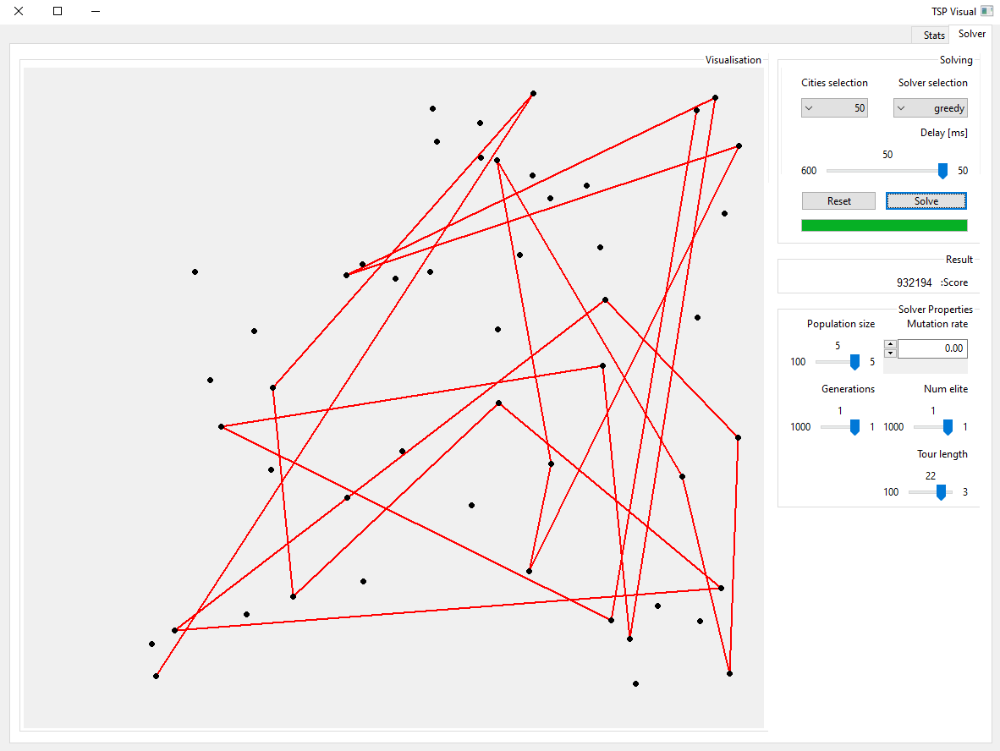

# Million Dollar tour $



## About
GUI is based on TSP visual: https://github.com/bcyran/tsp-visual

In this project we tried to come up with a solution for a complex minimax problem, 
considering a TSP variant which tries to maximize revenues and minimize independent expenses.

Implemented algorithms:
- Genetic algorithm
- Greedy search baseline
- Brute force  - optimal (w.r.t score)

## Running

### Python
instalation and running:
```
pip install -r requirements.txt
python -m noa_kirel
```
where `[file]` is an optional path to the `.tsp` file to open.

## Usage
Using TSP Visual is pretty straightforward, using drop-down menus will load a 
pre-generated dataset from noa_kirel/datasets directory; same goes for solvers.
Simply choose your desired solver and dataset, adjust the hyper parameters and hit 
"Solve".

## General Info
- Implemented solvers could be found under noa_kirel/solvers
- Evaluate: run noa_kirel/evaluation.py and then noa_kirel/analyze_results.py; 
  Note that this may take some time!
