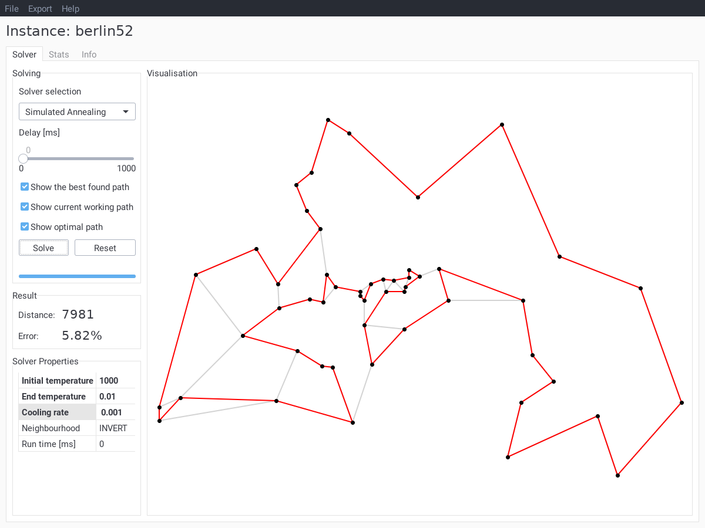

# TSP Visual




## About
TSP Visual is a program visualising the process of solving the travelling
salesman problem. It can open most of the instances from
[TSPLIB](http://comopt.ifi.uni-heidelberg.de/software/TSPLIB95/). It also comes
with following solving algorithms implemented:
* Greedy
* Brute Force
* Branch and Bound (depth first)
* Simulated Annealing
* Tabu Search
* Genetic Algorithm

## Running

### Python
If you have Python 3.7+ on your machine you can clone this repo, install
requirements and run TSP Visual:
```
pip install -r requirements.txt
python -m tspvisual [file]
```
where `[file]` is an optional path to the `.tsp` file to open.

### Executables
You can also [download
executables](https://github.com/bcyran/tsp-visual/releases) created using
[PyInstaller](https://www.pyinstaller.org/) for Linux and Windows. Note that
due to a (probably) bug in PyInstaller, Linux executable is huge at ~120MB. If
you know how to fix this, let me know!

## Usage
Using TSP Visual is pretty straightforward. First of all, you need to open
desired TSP instance using *File* menu. You will see the instance name in the
top part of the window and the cities drawn on the right. Note that not all
instances have display data. If you'll try to open such instance, you will be
informed. The program will still work, but you won't be able to see anything
besides the numbers which kinda beats the point.

With open TSP instance you can choose solver to use from the dropdown list on
the left part of the UI. If it's some kind of heuristics, various parameters
will be shown below, you can adjust those. And finally click *Solve* button.
Best path found by the solver (red) and current working path (black) will
appear on the instance visualisation.
